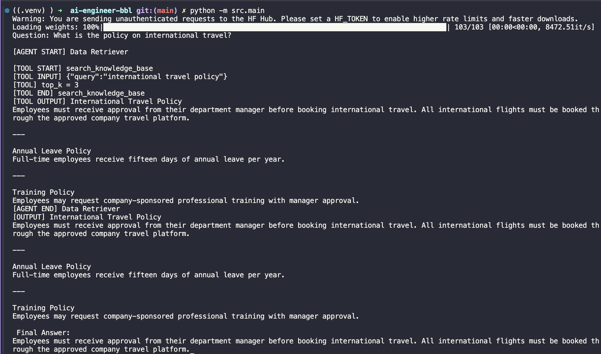
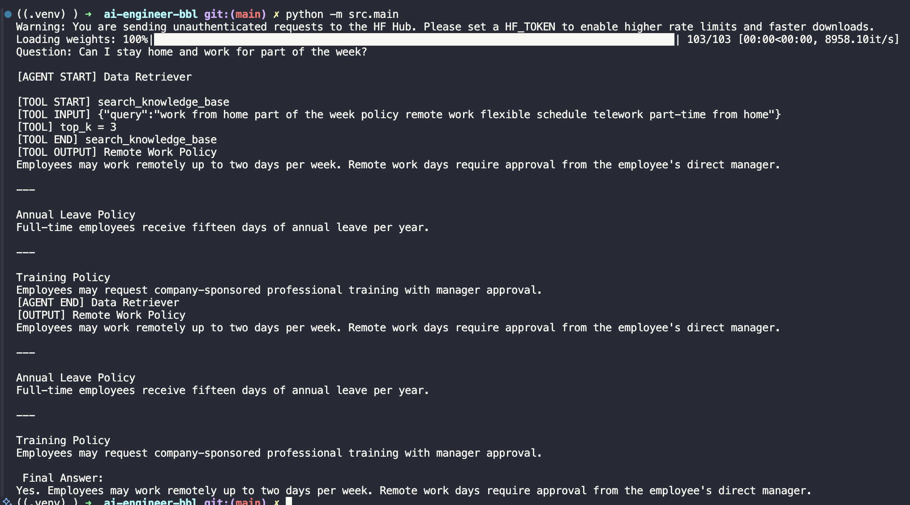
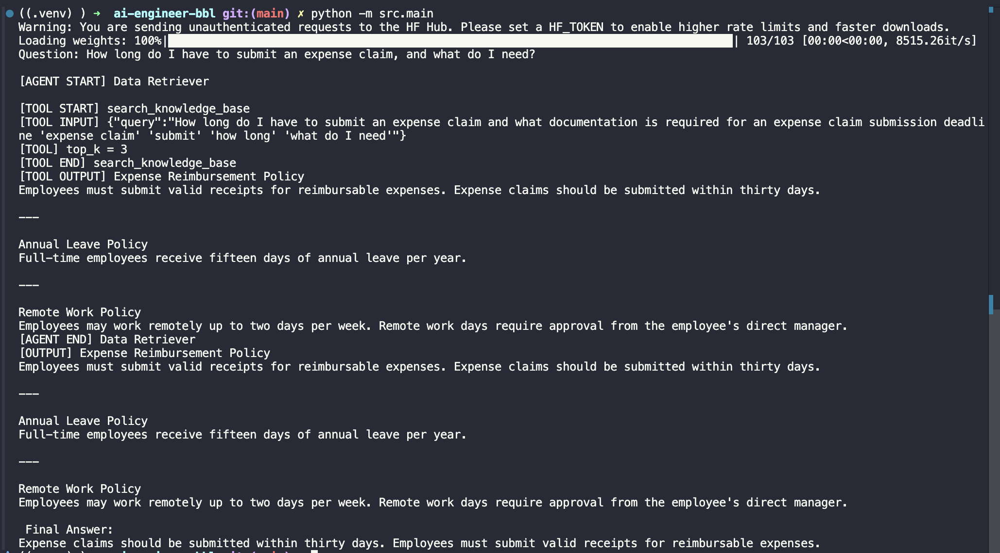
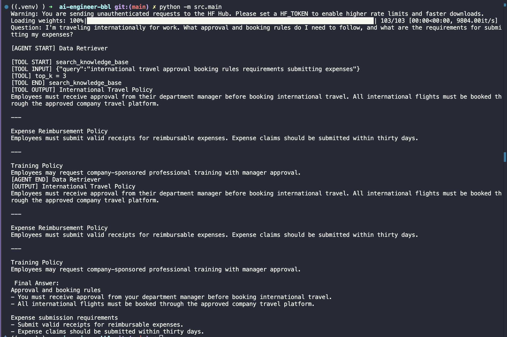
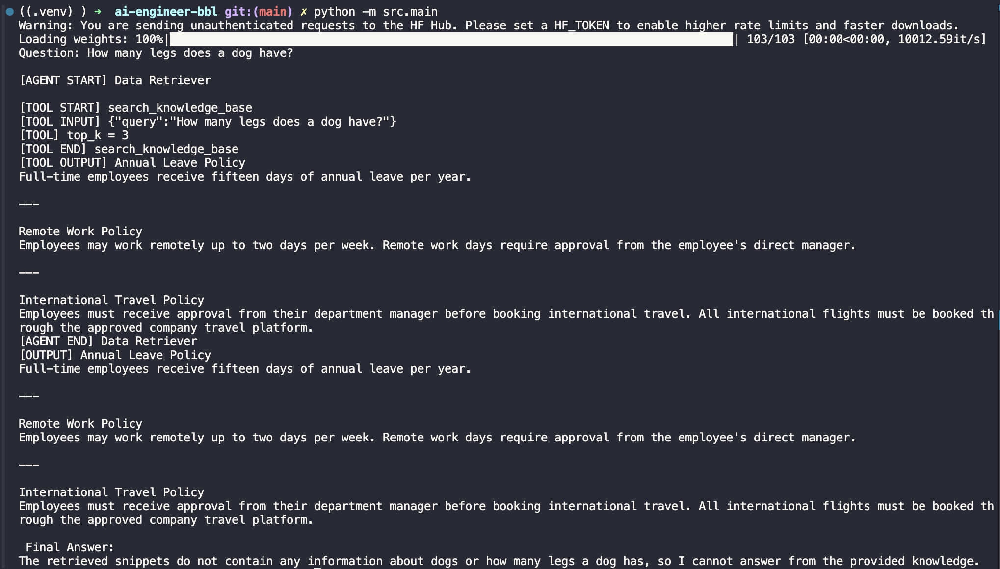

# AI Engineer BBL — Multi-Agent RAG

โปรเจกต์ระบบถาม–ตอบนโยบายบริษัทจากไฟล์ `knowledge_base.txt` โดยใช้ OpenAI Agents SDK สร้าง Agent สองตัวทำงานร่วมกัน และใช้ Retrieval-Augmented Generation (RAG) เพื่อให้คำตอบอ้างอิงเฉพาะข้อมูลที่ค้นพบในฐานความรู้ ลดการคาดเดาหรือการใช้ความรู้ทั่วไปของ LLM

## ความสามารถหลัก

- ค้นหาข้อมูลด้วย Semantic Search แม้คำถามไม่ได้ใช้คำเดียวกับฐานความรู้
- แยกหน้าที่การค้นหาและการเรียบเรียงคำตอบออกเป็นสอง Agent
- รวมข้อมูลจากหลาย policy เป็นคำตอบเดียวได้
- ปฏิเสธคำถามที่ฐานความรู้ไม่มีข้อมูลรองรับ
- ใช้ฐานความรู้แบบไฟล์ข้อความธรรมดาและประมวลผลทั้งหมดในหน่วยความจำ

## เทคโนโลยีที่ใช้

- **OpenAI Agents SDK (`openai-agents`)** — สร้าง Agent, Function Tool และควบคุมลำดับการทำงาน
- **OpenAI Python SDK** — เชื่อมต่อ LLM ผ่าน API ที่รองรับ OpenAI Responses API
- **Sentence Transformers** — สร้าง embedding สำหรับ Semantic Search
- **`sentence-transformers/all-MiniLM-L6-v2`** — แปลงคำถามและข้อความเป็นเวกเตอร์
- **python-dotenv** — อ่านค่าการเชื่อมต่อ API จากไฟล์ `.env`

## สถาปัตยกรรมและ Agent ในระบบ

ระบบใช้ **agent-as-tool pattern** ตามรูปแบบที่โจทย์กำหนด โดยมี Agent สองตัว:

1. **Report Generator** เป็น Agent หลัก รับคำถามจากผู้ใช้ เรียก Data Retriever ในรูปแบบ Tool และเรียบเรียงคำตอบให้กระชับ ชัดเจน และไม่ซ้ำซ้อน โดยใช้เฉพาะข้อมูลที่ค้นพบ
2. **Data Retriever** รับคำค้นจาก Report Generator แล้วเรียก Function Tool ชื่อ `search_knowledge_base` เพื่อส่งข้อความดิบที่เกี่ยวข้องกลับไป โดยไม่ตอบคำถามผู้ใช้เอง

แม้ Report Generator จะเป็นจุดเริ่มต้นของโปรแกรม แต่ Agent จะต้องเรียก Data Retriever ก่อนสร้างคำตอบเสมอ ทำให้ข้อมูลจาก Retriever ถูกส่งต่อให้ Generator ตามลำดับแบบ sequential workflow

```text
คำถามจากผู้ใช้
    ↓
Report Generator
    ↓ เรียก Agent ในรูปแบบ Tool
Data Retriever
    ↓ เรียก Function Tool
Semantic Search ใน knowledge_base.txt
    ↓ ส่ง 3 chunks ที่ใกล้เคียงที่สุด
Data Retriever ส่งข้อความดิบกลับ
    ↓
Report Generator คัดเลือกและเรียบเรียงข้อมูล
    ↓
Final Answer
```

## โครงสร้างโปรเจกต์

```text
.
├── knowledge_base.txt                 # ฐานความรู้นโยบายบริษัท
├── requirements.txt                   # Python dependencies
├── screenshots/                       # ผลการทดสอบ 5 กรณี
└── src/
    ├── main.py                         # รับคำถามและเริ่ม Agent workflow
    ├── config.py                       # อ่านค่าการเชื่อมต่อจาก environment
    ├── model.py                        # สร้าง LLM client และ model
    ├── agents/
    │   ├── data_retriever.py           # Agent สำหรับค้นข้อมูล
    │   └── report_generator.py         # Agent สำหรับสร้างคำตอบสุดท้าย
    └── tools/
        └── knowledge_retrieval.py      # Semantic Search Function Tool
```

## RAG และ Semantic Search ทำงานอย่างไร

เมื่อเริ่มโปรแกรม ระบบจะแบ่ง `knowledge_base.txt` เป็น chunks ตามบรรทัดว่าง แล้วสร้าง embedding ของแต่ละ chunk เก็บไว้ในหน่วยความจำ จากนั้นเมื่อมีคำถาม ระบบจะ:

1. สร้าง embedding ของคำถามด้วย `all-MiniLM-L6-v2`
2. เปรียบเทียบความคล้ายคลึงกับ embedding ของทุก chunk
3. เลือก 3 chunks ที่มีคะแนนสูงที่สุด (`top_k = 3`)
4. ส่งข้อความดิบให้ Report Generator
5. Report Generator เลือกเฉพาะข้อมูลที่เกี่ยวข้องและสร้างคำตอบสุดท้าย

โปรเจกต์นี้ไม่ใช้ Vector Database เนื่องจากฐานความรู้มีขนาดเล็ก การค้นหาจึงคำนวณจากข้อมูลในหน่วยความจำโดยตรง

## การติดตั้ง

ต้องมี Python 3.12 หรือเวอร์ชันที่เข้ากันได้ และต้องเชื่อมต่ออินเทอร์เน็ตสำหรับติดตั้งแพ็กเกจ ดาวน์โหลดโมเดล embedding ในการรันครั้งแรก และเรียก LLM API

```bash
python3 -m venv .venv
source .venv/bin/activate
python -m pip install -r requirements.txt
```

## การตั้งค่า API

สร้างไฟล์ `.env` จากไฟล์ตัวอย่าง:

```bash
cp .env.example .env
```

กำหนดค่าต่อไปนี้ใน `.env`:

```env
BBL_LLM_BASE_URL=https://your-api-endpoint
BBL_LLM_API_KEY=your-api-key
BBL_LLM_MODEL=your-model-name
```

- `BBL_LLM_BASE_URL` — Base URL ของบริการ LLM ที่รองรับ OpenAI Responses API
- `BBL_LLM_API_KEY` — API Key สำหรับเรียกใช้งาน
- `BBL_LLM_MODEL` — ชื่อโมเดลที่ API รองรับ เช่น `gpt-5-mini`

ห้าม commit ไฟล์ `.env` หรือเผยแพร่ API Key โดย `.env` ถูกเพิ่มไว้ใน `.gitignore` แล้ว

## การรัน

รันคำสั่งจากโฟลเดอร์หลักของโปรเจกต์:

```bash
python -m src.main
```

จากนั้นพิมพ์คำถามที่ `Question:` โปรแกรมจะแสดง log การทำงานของ Agent และ Tool ก่อนแสดงคำตอบสุดท้ายในส่วน `Final Answer:`

หากเพิ่มหรือแก้ไขข้อมูลใน `knowledge_base.txt` ให้เริ่มโปรแกรมใหม่เพื่อสร้าง embedding ใหม่

## ผลการทดสอบ

ผลลัพธ์จริงอาจใช้ถ้อยคำต่างกันเล็กน้อยในแต่ละครั้ง เนื่องจากคำตอบถูกเรียบเรียงโดย LLM แต่ข้อเท็จจริงต้องมาจากข้อมูลที่ Retriever ส่งให้เท่านั้น

### 1. International Travel — คำถามตัวอย่างใกล้กับโจทย์

คำถาม:

```text
What is the policy on international travel?
```

คำตอบที่คาดหวังโดยสรุป:

```text
Employees must receive approval from their department manager before booking
international travel, and all international flights must be booked through the
approved company travel platform.
```

กรณีนี้สำคัญเพราะโจทย์ยกคำถามเรื่อง international travel เป็นตัวอย่างโดยตรง ระบบสามารถค้นหา policy ที่ถูกต้องและตอบเงื่อนไขทั้งการขออนุมัติและการจองเที่ยวบินได้



### 2. Remote Work — Semantic Search

คำถาม:

```text
Can I stay home and work for part of the week?
```

คำตอบที่คาดหวังโดยสรุป:

```text
Employees may work remotely up to two days per week, with approval from their
direct manager.
```

ผู้ใช้ไม่ได้ระบุคำว่า `Remote Work Policy` ตรง ๆ แต่ Semantic Search ยังสามารถเชื่อมโยงความหมายของการทำงานจากบ้านกับ Remote Work Policy และค้นข้อมูลที่ถูกต้องได้



### 3. Expense Reimbursement — หลายข้อเท็จจริงจาก chunk เดียว

คำถาม:

```text
How long do I have to submit an expense claim, and what do I need?
```

คำตอบที่คาดหวังโดยสรุป:

```text
Expense claims should be submitted within thirty days, and valid receipts are
required for reimbursable expenses.
```

กรณีนี้ทดสอบว่า Retriever สามารถดึง chunk ที่เกี่ยวข้อง และ Report Generator สามารถรวมข้อเท็จจริงสองส่วน ได้แก่ระยะเวลายื่นคำขอและเอกสารที่ต้องใช้ เป็นคำตอบเดียวที่ไม่ซ้ำซ้อนได้



### 4. International Travel และ Expense — Multi-chunk Query

คำถาม:

```text
I'm traveling internationally for work. What approval and booking rules do I
need to follow, and what are the requirements for submitting my expenses?
```

กรณีนี้แสดงความสามารถของ workflow ในการค้นข้อมูลหลายส่วนและรวมเป็นคำตอบเดียว:

```text
Question
   ↓
Data Retriever
   ↓
Top 3 chunks

1. International Travel Policy    ← ใช้
2. Expense Reimbursement Policy   ← ใช้
3. Policy อื่นที่คะแนนใกล้เคียง    ← ไม่ใช้
   ↓
Report Generator
   ↓
รวมข้อมูลจาก chunk 1 และ chunk 2
   ↓
Final Answer
```

Report Generator ต้องเลือกเฉพาะ International Travel Policy และ Expense Reimbursement Policy แล้วตอบทั้งกฎการอนุมัติ การจองเที่ยวบิน หลักฐานใบเสร็จ และระยะเวลายื่นค่าใช้จ่าย โดยไม่ดึง policy ที่ไม่เกี่ยวข้องมาใส่ในคำตอบ



### 5. Out-of-scope — ป้องกันการใช้ความรู้ทั่วไปของ LLM

คำถาม:

```text
How many legs does a dog have?
```

เนื่องจาก `knowledge_base.txt` ไม่มีข้อมูลเกี่ยวกับสุนัข ระบบจึงต้องไม่ตอบว่า `A dog has four legs.` แม้ LLM จะรู้คำตอบจากความรู้ทั่วไปก็ตาม

ปัจจุบัน `top_k = 3` บังคับให้ Retriever คืน 3 chunks ที่มีคะแนนใกล้ที่สุดเสมอ แม้ทุก chunk จะไม่เกี่ยวข้องกับคำถาม หน้าที่ของ Report Generator คือสังเกตว่าไม่มีข้อมูลรองรับและปฏิเสธการตอบ แทนการแต่งคำตอบขึ้นเอง

คำตอบที่คาดหวังควรมีความหมายประมาณว่า:

```text
The retrieved information does not contain an answer to this question, so the
question cannot be answered from the provided knowledge base.
```



## สภาพแวดล้อมที่ทดสอบ

โปรเจกต์ได้รับการทดสอบด้วย:

- Python 3.12.14
- `openai-agents` 0.22.0
- `openai` 3.3.1
- `sentence-transformers` 6.0.0
- `python-dotenv` 1.2.3

## ข้อจำกัดและแนวทางพัฒนาต่อ

- ระบบกำหนด `top_k = 3` แบบคงที่และยังไม่มี similarity threshold จึงอาจคืน chunks ที่ไม่เกี่ยวข้องมาด้วย
- ความถูกต้องของ out-of-scope response ยังขึ้นอยู่กับ Report Generator ในการปฏิเสธข้อมูลที่ไม่มีหลักฐานรองรับ
- Embedding และ chunks ถูกเก็บในหน่วยความจำ จึงเหมาะกับฐานความรู้ขนาดเล็ก
- โปรแกรมรับคำถามครั้งละหนึ่งคำถามและสิ้นสุดการทำงานหลังแสดงคำตอบ
- การรันครั้งแรกต้องดาวน์โหลดโมเดล embedding จาก Hugging Face
- `requirements.txt` ยังไม่ได้ล็อกเวอร์ชันของ dependencies; เวอร์ชันที่ทดสอบจริงระบุไว้ด้านบนเพื่อใช้อ้างอิง
- ยังไม่มี automated tests สำหรับ retrieval quality และ agent workflow
